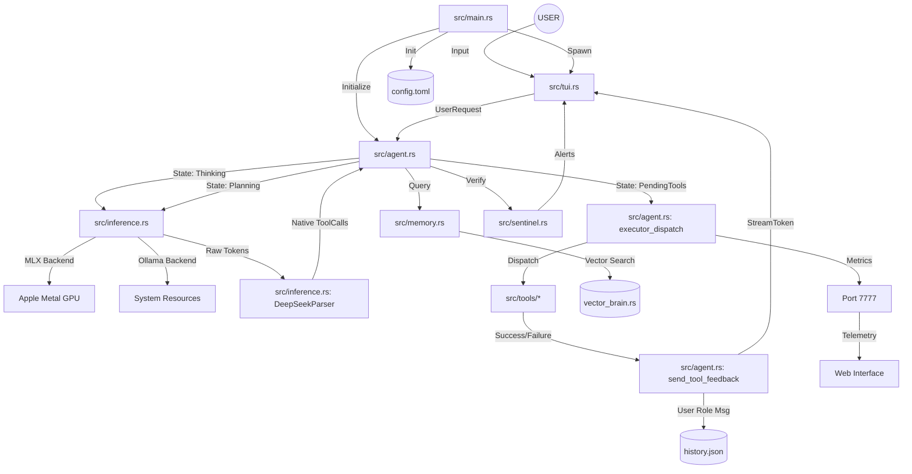

# 🌪️ Tempest AI: Knowledge Graph

This document visualizes the internal architecture and data flow of the Tempest AI engine.

## 🧠 System Architecture (Mermaid)

## 🛰️ Key Interaction Chains

### 1. The Reasoning Loop
1. **User** sends a task via the **TUI**.
2. **Agent** enters `Thinking` state and builds a context-aware prompt.
3. **Inference** (MLX) streams reasoning tokens back to the **TUI**'s reasoning pane.
4. If a tool is detected, **Parser** extracts the JSON (even if leaked in `<think>` blocks).

### 2. The Execution Bridge
1. **Agent** transitions to `PendingTools`.
2. **Executor** runs the tool (e.g., `list_dir`) and acquires a **Concurrency Permit**.
3. **Feedback** is formatted and sent to the **TUI** as a `StreamToken`.
4. The result is pushed to **History** as a `User` role message to re-trigger the next reasoning turn.

### 3. The Sentinel Guard
1. Before every turn, the **Sentinel** audits the editor state.
2. If it detects a "Code Dump" or missing reasoning, it injects a **State Context** into the prompt to correct the model's behavior.

---
*Generated by Tempest AI - 2026-05-03*
