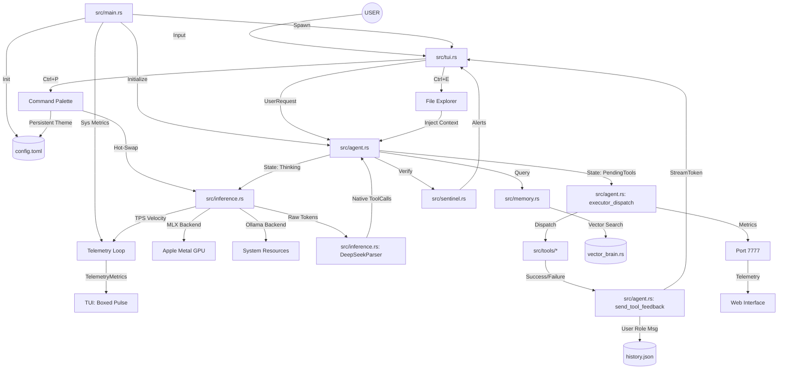

# 🌪️ Tempest AI: Knowledge Graph (v0.3.0 "Cyber-Orchestrator")

This document visualizes the internal architecture and data flow of the Tempest AI engine.

## 🧠 System Architecture (Mermaid)

## 🛰️ Key Interaction Chains (v0.3.0)

### 1. The Mission Control Pulse
1. **System Monitor** (in `main.rs`) polls hardware stats every 1s.
2. **Inference Loop** (in `inference.rs`) calculates Tokens Per Second (TPS) during streaming.
3. Both streams broadcast `TelemetryMetrics` to the **TUI** asynchronously.
4. The **TUI** renders these into the boxed sparkline zone for real-time observability.

### 2. The Command Orchestration Hub
1. User invokes **`Ctrl+P`** fuzzy-searchable palette.
2. Selecting a **Theme** triggers a TUI state update and a persistent write to `config.toml`.
3. Selecting a **Model Preset** triggers a backend re-initialization in the **Inference Layer**.

### 3. The Explorer Context Bridge
1. User invokes **`Ctrl+E`** to navigate the workspace.
2. Selecting a file injects a `[CONTEXT: path]` tag into the **Input Buffer**.
3. Upon submission, the **Agent** reads the file and prioritizes it as "Ground Truth" during planning.

---
*Generated by Tempest AI - 2026-05-04*
