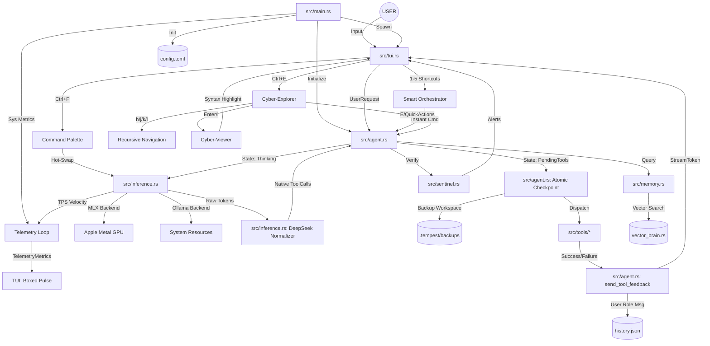

# 🌪️ Tempest AI: Knowledge Graph (v0.3.1 "Cyber-Orchestrator")

This document visualizes the internal architecture and data flow of the Tempest AI engine.

## 🧠 System Architecture (Mermaid)

## 🛰️ Key Interaction Chains (v0.3.1)

### 1. The Atomic Engineering Cycle
1. **Inference engine** generates a tool call.
2. **DeepSeek Normalizer** repacks flat arguments into strict schema objects.
3. **Agent** triggers an **Atomic Checkpoint**, backing up all targeted files.
4. **Executor** dispatches the tool.
5. If user invokes **`/undo`**, the agent restores the workspace from the checkpoint instantly.

### 2. The Smart Orchestration Loop
1. **TUI** manifests the **Smart Orchestrator Panel** with context-aware suggestions.
2. User navigates via **Cyber-Explorer** (`h/j/k/l`).
3. Pressing **`1-5`** instantly repacks the suggested action into an agent command.

### 3. The High-Fidelity Context Bridge
1. User selects a file in **Cyber-Explorer**.
2. **Cyber-Viewer** manifest the file content for human observation.
3. User presses **`e`** to inject context or **`f`** to trigger a "Fix" pulse.

---
*Generated by Tempest AI - 2026-05-04*
