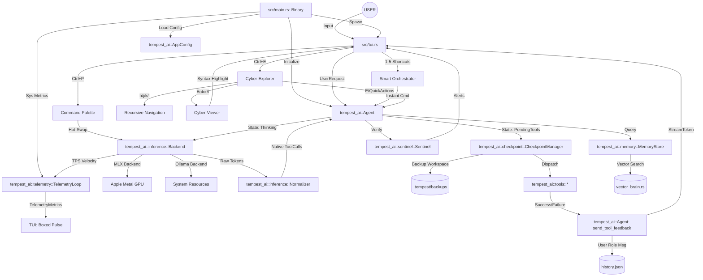

# 🌪️ Tempest AI: Knowledge Graph (v0.3.1 "Cyber-Orchestrator")

This document visualizes the internal architecture and data flow of the Tempest AI engine.

## 🧠 System Architecture (Mermaid)

## 🛰️ Key Interaction Chains (v0.3.1)

### 1. The Library Core Architecture
The system is now split into a thin **Binary Shell** (`src/main.rs`) and a high-performance **Library Core** (`tempest_ai`). This allows for stable telemetry, consistent configuration loading, and allows the core engine to be shared across CLI, TUI, and potentially future GUI/WASM interfaces.

### 2. The Atomic Engineering Cycle
1. **Inference engine** generates a tool call via the library's `Backend`.
2. **DeepSeek Normalizer** repacks flat arguments into strict schema objects.
3. **Agent** triggers an **Atomic Checkpoint** through the `CheckpointManager`, backing up all targeted files.
4. **Executor** dispatches the tool.
5. If user invokes **`/undo`**, the agent restores the workspace from the checkpoint instantly.

### 3. The Smart Orchestration Loop
1. **TUI** manifest the **Smart Orchestrator Panel** with context-aware suggestions.
2. User navigates via **Cyber-Explorer** (`h/j/k/l`).
3. Pressing **`1-5`** instantly repacks the suggested action into an agent command dispatched to the library core.

---
*Generated by Tempest AI - 2026-05-07*
