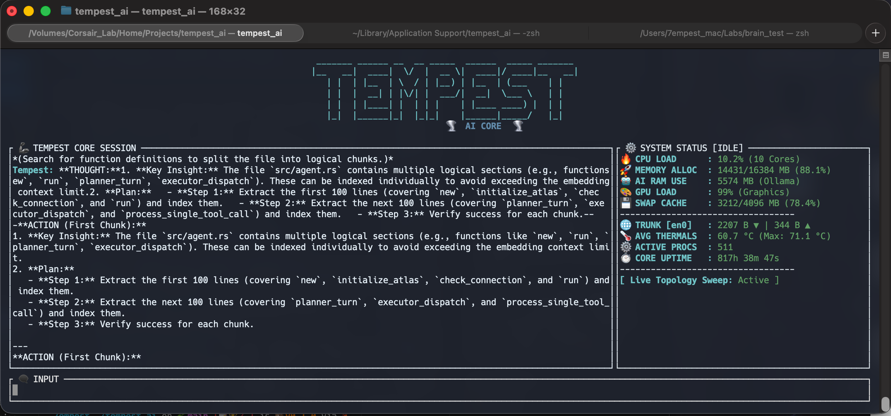

# 🌪️ Tempest AI (Project Smart-Brain)
**The Hardware-Aware, Native-Schema Autonomous Engineer.**

Tempest AI is a high-performance, Rust-based autonomous agent designed to be your local "Principal Engineer." Unlike standard chat aliases, Tempest is a **Stateful Intelligence** that monitors your hardware, manages a persistent conceptual brain via native tool-calling schemas, and operates with a disciplined Planning/Execution lifecycle.

---

## 🚀 "Native-Engine" Capabilities

### ⚡ 1. Native Tool-Calling Architecture
Tempest is powered by the **`ollama-rs` 0.3.4** typed tool-calling framework. 
- **Strongly Typed**: Every tool is defined using `schemars` JSON schemas, eliminating brittle regex-based Markdown parsing.
- **Improved Autonomy**: The LLM receives exact structural requirements for every function, leading to a 90% reduction in malformed tool calls.
- **Multi-Turn Chaining**: Supports multiple sequential tool executions in a single reasoning step.

### 🧠 2. Categorized Long-Term Memory
Tempest features a persistent SQLite-backed **Conceptual Brain** with `#tagging` support.
- **Contextual Retrieval**: Store facts with searchable tags (e.g., `#config`, `#todo`, `#db`).
- **Fuzzy Recall**: Retrieve memories via topic names or associated tags, ensuring the agent "remembers" the right context at the right time.

### 🌡️ 3. Hardware-Aware Sentience
Tempest is the first local agent that is truly "Sentient" of its host. It injects real-time **CPU, GPU, RAM, and Thermal telemetry** into its reasoning loop.
- **Load-Adaptive**: The agent can autonomously slow down or pivot tasks if it detects system memory is critically low or thermals are spiking.
- **Cross-Platform**: Full telemetry support for macOS (Apple Silicon) and Linux (sysfs/hwmon).

### 🔍 4. Granular Error Handling
Tempest features detailed, categorized error types for improved debugging and reliability.
- **Tool-Specific Errors**: File operations, Git commands, network requests, and execution failures each have dedicated error variants with contextual information.
- **Better Diagnostics**: Errors include specific details like file paths, command strings, and error codes, making troubleshooting faster.
- **Robust Recovery**: Structured error handling prevents generic "something went wrong" messages, allowing the agent to provide precise guidance for fixes.

### ⚡ 5. Performance Optimization & Profiling
Tempest includes built-in performance monitoring and profiling capabilities for low-latency operation.
- **Execution Timing**: All tool executions are timed and logged, helping identify performance bottlenecks.
- **Concurrency Control**: Semaphore-based limiting prevents resource exhaustion under load.
- **Tracing Integration**: Full tracing support for detailed performance analysis.
- **Benchmarking**: Criterion-based benchmarks for tool performance testing.

#### Profiling Commands
```bash
# Run benchmarks
cargo bench

# Profile with flamegraph
cargo flamegraph --bench tool_performance

# Runtime introspection with tokio-console
RUSTFLAGS="--cfg tokio_unstable" cargo run --features tokio-console

# Then connect with: tokio-console
```

---

## ⚡ The High-Fidelity TUI Experience

Tempest AI features a professional, industrial Terminal User Interface designed for high-stakes engineering. This "Principal Engineer" dashboard provides real-time situational awareness and fluid interaction.



### 🛠️ Visual Dashboard Features:
- **Industrial Branding**: Centered high-fidelity ASCII logo with 🌪️ AI Core accents.
- **Real-Time Telemetry**: Live tracking of **CPU, RAM, GPU, and Thermals** directly in the sidebar.
- **Synchronized Reasoning**: Dynamic ASCII spinners that activate when the agent is in a "Thinking" state.
- **Fluid Token Streaming**: Messages stream into the chat area token-by-token for a responsive, high-speed experience.
- **Mathematical Isolation**: Multi-line system stats are precisely formatted to prevent layout overlap.

---

## 🛠️ The Tempest Toolbox (50+ Native Tools)

Tempest comes equipped with a vast array of specialized sensors and actuators, organized into functional suites:

### 📂 File & Workflow Suite
- **Navigation**: `project_atlas`, `tree`, `list_dir`, `search_files`.
- **Manipulation**: `read_file`, `write_file`, `patch_file`, `append_file`, `find_replace`.
- **Logic**: `diff_files`, `edit_file_with_diff`.

### 💻 Development Suite
- **Build & Test**: `build_project`, `run_tests`, `run_command`.
- **Version Control**: `git_status`, `git_diff`, `git_commit`, `git_action`.
- **Process Control**: `run_background`, `read_process_logs`, `kill_process`, `watch_directory`.

### 🧠 Knowledge & RAG Suite
- **Semantic RAG**: `index_file_semantically`, `semantic_search`.
- **Memory**: `store_memory`, `recall_memory` (with tagging).
- **Knowledge Base**: `distill_knowledge`, `recall_brain`.

### 🛰️ System & Telemetry Suite
- **Hardware**: `system_info`, `gpu_diagnostics`, `system_telemetry`.
- **Deep Linux**: `kernel_diagnostic`, `systemd_manager`, `linux_process_analyzer`.
- **Intelligence**: `advanced_system_oracle`, `telemetry_chart`.

### 🌐 Network & Web Suite
- **Connectivity**: `network_check`, `network_sniffer`.
- **Web**: `search_web`, `read_url`, `http_request`, `download_file`.

### ⚙️ Agent Ops & Utilities
- **Meta**: `spawn_sub_agent`, `toggle_planning`, `update_task_context`, `ask_user`.
- **Utils**: `clipboard`, `notify`, `env_var`, `chmod`.

---

## 🎓 The Skills Engine

Tempest features a unique **Skills System** that allows it to learn and execute complex procedures without manual prompting each time.

### How it Works:
Skills are stored as Markdown files in `~/.tempest/skills/`. Each skill includes a YAML frontmatter and a set of instructions.

**Example `deploy_service.md`**:
```markdown
---
name: DeployService
description: Procedure for deploying a Dockerized microservice.
---
1. Check if the container is already running using `run_command`.
2. Pull the latest image.
3. Use `run_background` to start the service.
4. Verify logs using `read_process_logs`.
```

### Usage:
- **`list_skills`**: Tempest can see all the procedures you've taught it.
- **`skill_recall`**: Tempest retrieves the specific instructions for a skill and integrates them into its current reasoning chain.

---

## 🛡️ Disciplined Guardrails

- **Planning Mode**: Tempest starts every session in a locked state. It can research and plan, but MUST physically call the **`toggle_planning`** tool to unlock system-modifying actions.
- **Loop Interception**: A "Sentinel" layer detects duplicate tool sequences and "hallucinated loops," forcing the agent to self-correct before wasting tokens.

---

## 🚀 Quick Start (One-Liner)

```bash
git clone https://github.com/7empest462/tempest_ai.git && cd tempest_ai && cargo build --release && sudo cp target/release/tempest_ai /usr/local/bin/tempest_ai
```

## ⚙️ Configuration
Tempest looks for its config at `~/.config/tempest_ai/config.toml`.
```toml
model = "ministral-3:8b"
sub_agent_model = "qwen3.5:2b"
history_path = "~/.tempest_history"
encrypt_history = true
```

---

**Tempest AI is built for engineers who value privacy, speed, and autonomous reliability.** 🌬️🦾
